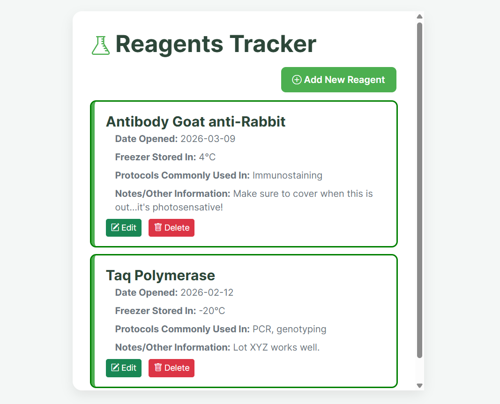
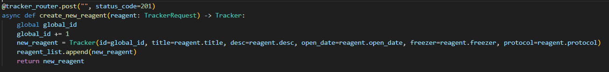
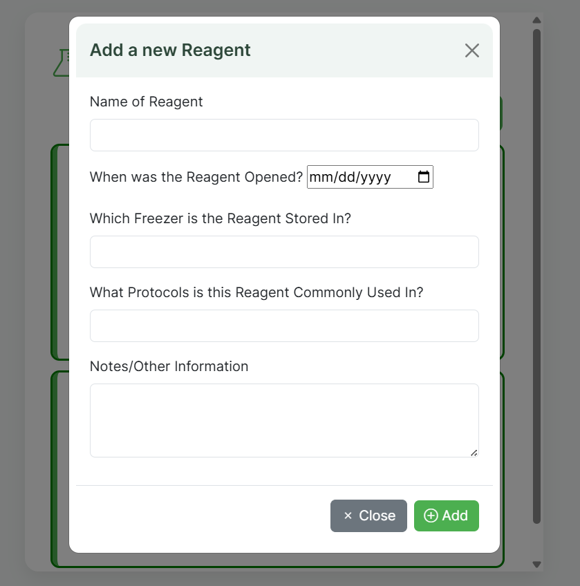
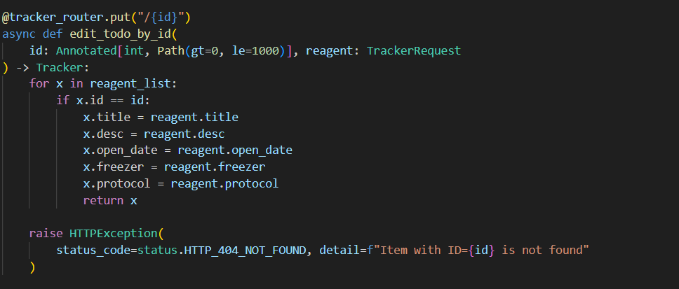
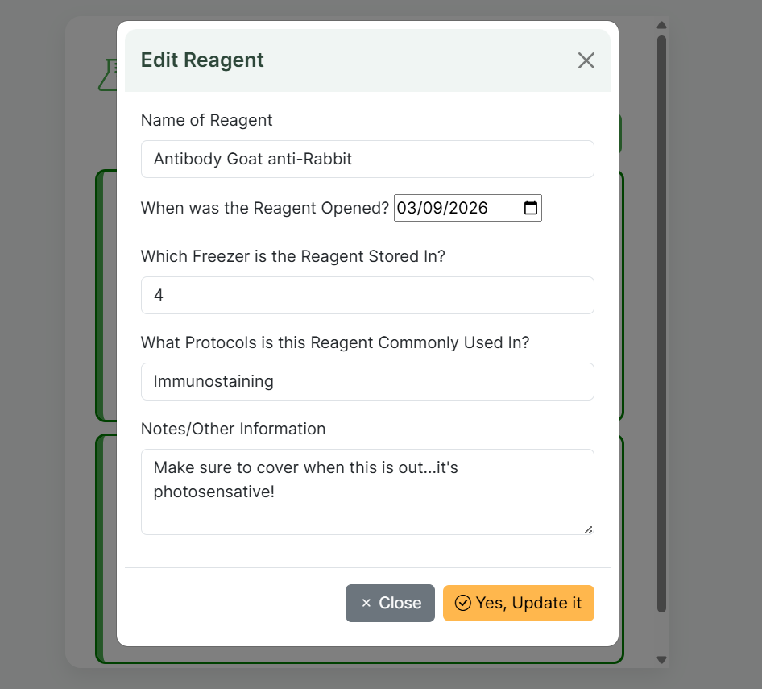

 # Midterm: Lab Reagent Tracker
This assignment was done to further my understanding of creating virtual environments, setting up FastAPI, creating CRUD API endpoints, and connecting frontend with backend using HTTP calls and combine these tasks into one overall application.

Overall: <br>
Backend -> FastAPI  <br>
Frontend -> HTML/JS/CSS

## Prerequisites and Usage
Packages were installed in a virtual environment, so users must enter the virtual environment to run the files. Outlined below are instructions on how to enter the virtual environment, exit the virtual environment, and run the files through the terminal. 

To enter the virtual environment: ```.\venv\Scripts\activate``` <br>
To exit the virtual environment: ```deactivate```

Install any dependencies needed via the requirements.txt file.

Once in venv, run the app via uvicorn with the following commands:

 ```uvicorn main:app --reload``` <br>
Open the link that is given in the terminal to run the app. 

## Lab Reagent Tracker
In many biomedical labs, including the one I am part of, there are often many reagents, or chemicals, that are used in various protocols that are needed to run our experiments. Each reagent has a specific temperature that it must be kept at as well as a half-life that must be monitored. Thus, it is important to know in which freezer the reagent is stored, when it was opened, and more general information. So, I sought to create an app that tracks all this information, allowing users to create new reagents when they buy or open one, update reagents when they are running low, and delete old/empty reagents off the list. 

## Uvicorn, FastAPI, JS, HTML, and CSS
This app was created via uvicorn, with a main python file that links the API to the frontend html. This was also accomplished via API routers that helped with the connection. 

Styling was achieved via Bootstrap 5 for a cleaner layout. I used JS and XHR to perform asynchronous API calls, similar to the ones shown in the Todo example. The app also provides some validation, so if any of the fields are left blank when creating or updating a reagent, an error message will be shown on the screen to prompt users to fill out all fields before continuing. Further, to limit the inconsistencies with date formatting, I added a "date" component to the modal, allowing users to just select a date, keeping the formatting consistent.  

## CRUD Application: Create, Read, Update, Delete
The backend is built with FastAPI and a list for memory. It utilizes APIRouter and Pydantic for data validation. This Lab Reagent Tracker is a CRUD Application and has all the functions of one. Users are currently reading all entries as they are displayed onto the screen, once they are made (GET API call). Reagents are displayed in chronological order, and the most recently opened ones are at the top of the list, since this is what users will be using most frequently. It also allows them to make any edits and add notes in the text sections, such as if a reagent is running low and we need to order more. Users can create new reagents to add to the tracker by clicking the "Add Reagent" button in the top right (POST API call). They can also edit a reagent by clicking the "Edit" button in the bottom left of each card (PUT API call) or delete the reagent by the "Delete" button (DELETE API call). When editing, users can update any of the fields and then click the "Yes, Update It" button to save or the "Close" button to discard changes. 

#### Code snippet followed by App Images:

Whole App: 


Example of CRUD Code for the Add feature: 

Add Modal:



Example of CRUD Code for the Edit feature: 


Edit Modal:


